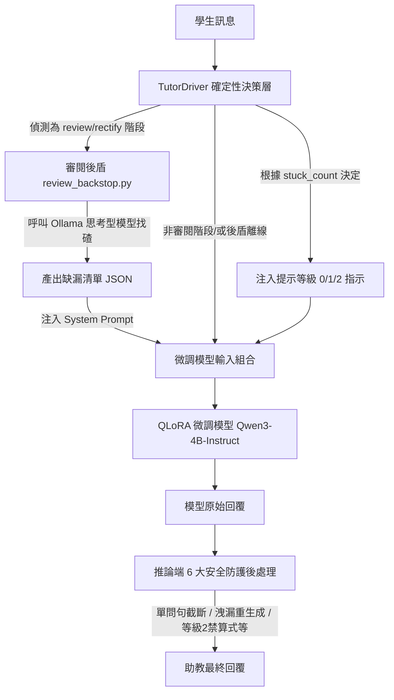

# 蘇格拉底式高等數學證明引導助教 — 架構設計文件

本文件旨在為開發者詳細說明本專案（**Socratic Calculus Proof Tutor**）的整體架構、目錄結構、各檔案之功能以及核心機制的實現細節。

---

## 一、 系統整體架構 (System Architecture)

本專案的核心目標是將 **Qwen3-4B-Instruct** 微調成一個能夠引導學生自主完成高等數學（微積分/數學分析）證明的蘇格拉底式助教。為了在小型模型（4B）上實現高精確度的數學邏輯判斷，並防止模型洩漏參考解答，本系統採用了**混合式對話驅動架構 (Hybrid Socratic Tutor Architecture)**：



### 混合式架構的核心設計原則：
1. **決策與內容分離**：離散決策（如「何時升級提示」、「何時轉換階段」）交給確定性的 Python 驅動程式控制；引導內容的拿捏（如「提示的深度」）交給預寫的 `hint_ladders.json` 與參考解答；AI 模型僅負責數學語言的包裝與口氣引導。
2. **判斷與說話分工**：在需要精準判斷學生證明草稿的階段（`review`、`rectify`），若單純依靠 4B 模型容易出現「察覺錯誤但解釋錯誤」或「錯誤背書」的問題。因此，本系統在後台引入思考型大模型（如 `qwen3-4b-thinking`）作為「找碴員」（審閱後盾），微調後的 4B 模型則專注於扮演親和的助教，將後台產出的缺漏清單以引導性問題呈現。

---

## 二、 目錄結構與檔案功能導覽

本 repo 的完整檔案結構如下：

### 1. 專案根目錄
*   [README.md](README.md)：專案對外的說明文件，包含快速開始、安裝與基本使用。
*   [CLAUDE.md](CLAUDE.md)：開發與指令速查手冊，記錄了環境設定、判定數據及常用工作指令。
*   [architecture_design.md](architecture_design.md)：（本文件）系統架構與核心機制說明。
*   [dataset_plan.md](dataset_plan.md)：高等數學蘇格拉底引導資料集的設計企劃書。
*   [socratic_math_research.md](socratic_math_research.md)：華東師範大學 SocraticMath 數據集的研究心得與微積分證明挑戰的適應性分析。
*   [PUSH_SCOPE.md](PUSH_SCOPE.md)：git 推送範圍與檔案忽略規格說明。

---

### 2. 資料集與驅動層：`dataset/`
此目錄是整個系統運行的核心，包含對話驅動、審閱後盾、資料集建置與測試。

#### 核心邏輯檔案
*   [tutor_driver.py](dataset/tutor_driver.py)：**有狀態的蘇格拉底對話驅動程式**。負責管理 stuck counter、階段偵測、組合 Grounded system prompt、套用 6 大安全防護機制，並對外提供 `start()` 與 `step()` 介面。
*   [review_backstop.py](dataset/review_backstop.py)：**審閱後盾模組**。在 `review`/`rectify` 階段，透過 API 呼叫本地運行的 Ollama 思考型模型。包含對 LaTeX 的 JSON 轉義容錯與自動降級機制。
*   [interactive_turn.py](dataset/interactive_turn.py)：**互動式命令列 (CLI) 工具**。開發者與學生可在此進行逐輪對話測試，系統會維護並持久化 session 狀態。

#### 資料建置與驗證
*   [build.py](dataset/build.py)：資料集重組腳本。收集 `src/` 中的題目與對話原始碼，注入 Grounded 系統模板，分流 core 與 augmented 資料，並以 9:1 的比例隨機切分出 `train.jsonl` 與 `val.jsonl`。
*   [validate.py](dataset/validate.py)：全量資料集品質驗證器。以硬性規則檢驗對話結構、字數上限、一問一等、無洩漏關鍵字等。
*   `src/` & `src_en/`：收錄 50 道手寫微積分/數學分析題目（`problems_*.py`）及 400 條多輪引導對話原始碼（`dialogues_*.py`），分別為繁體中文與英文版。
*   `problems.json` / `problems_en.json`：由 `build.py` 生成的題目檔案，含題目陳述、難度與 LaTeX 參考解答。
*   `hint_ladders.json` / `hint_ladders_en.json`：為 50 道題目預寫的分級提示內容（分步想法，但不含數學式子），由 `TutorDriver` 在等級 2 提示時讀取並注入。
*   `train.jsonl` / `val.jsonl`：最終的 SFT 訓練與驗證資料。

#### 評估與測試
*   [test_driver_unit.py](dataset/test_driver_unit.py)：對 `TutorDriver` 中的確定性邏輯（如 stuck 偵測、階段判定、6 大防護）進行**無 GPU 單元測試**（含 51 個斷言）。
*   [test_driver_integration.py](dataset/test_driver_integration.py)：驗證有 GPU 參與時的分級提示機制。
*   [test_driver_phase.py](dataset/test_driver_phase.py)：驗證對話階段的移轉機制（GPU）。
*   [test_backstop.py](dataset/test_backstop.py)：測試後盾對學生證明草稿中邏輯缺漏的判斷準確度。
*   [eval_backstop_e2e.py](dataset/eval_backstop_e2e.py)：端對端評估加入後盾後對最終引導效果的改善。
*   [eval_final_driver.py](dataset/eval_final_driver.py)：對部署狀態（微調模型 + TutorDriver + 審閱後盾）在 8 道 held-out 評估題與對抗情境下的成效進行 LLM-as-judge 自動化評分。
*   [eval_heldout_v3.py](dataset/eval_heldout_v3.py) / [eval_hard.py](dataset/eval_hard.py) / [eval_xdomain.py](dataset/eval_xdomain.py)：分別對裸模型回歸、難題分布、以及跨領域遷移（線性代數、離散數學）進行評估。
*   `eval_out_final/` 等目錄：存放詳細的評估 verdict 與生成報告。

---

### 3. 微調訓練引擎：`learn_path/socratic_tutor/`
此目錄提供 QLoRA 微調的核心程式碼。

*   [common.py](learn_path/socratic_tutor/common.py)：共用設定檔。定義基底模型名稱（Qwen3-4B-Instruct-2507）以及訓練資料、輸出 Adapter 的路徑，支援環境變數覆寫。
*   [train_qlora.py](learn_path/socratic_tutor/train_qlora.py)：**QLoRA 微調主程式**。使用 4-bit nf4 載入模型，套用 LoRA 進行參數高效微調。實作了 **Assistant-only Loss Masking** 與**左截斷多輪對話序列保留視窗**。
*   [download_chunked.py](learn_path/socratic_tutor/download_chunked.py)：分塊下載 Qwen3-4B-Instruct 模型的實用工具，避免大檔案在受限網路環境下載中斷。
*   [test_4bit_load.py](learn_path/socratic_tutor/test_4bit_load.py)：4-bit 模型載入煙霧測試，確保 BitsAndBytes 在本機 GPU 上可順利初始化且不引發 Windows Segfault。

---

## 三、 核心機制詳解 (Core Mechanisms)

### 1. TutorDriver 的階段與提示狀態機

`TutorDriver` 的狀態流主要由兩個維度驅動：**對話階段 (Phase)** 與 **卡住計數 (stuck_count)**。

#### A. 階段偵測 (Phase Detection)
每次收到學生的回覆時，`TutorDriver` 會使用正則表達式快速匹配學生意圖，強制鎖定本輪的階段：
*   **拒絕洩漏 (`refuse_leak`)**：當學生逼問答案或完整證明時（例如「直接告訴我答案」），偵測 `_DEMAND_RE` 命中，強迫微調模型以溫和拒絕句（「自己推導才真正有用」）開頭，並重新引導。
*   **邏輯糾錯 (`rectify`)**：當學生提出具體的推導嘗試並要求確認時（例如「這樣對嗎」），`_ATTEMPT_RE` 命中，進入糾錯引導，指出核心錯誤而不替其修改。
*   **要求寫證明 (`writeup_request`)**：當學生在引導下完成所有關鍵步驟並宣稱「懂了」時，`_UNDERSTOOD_RE` 命中，驅動程式會指示模型要求學生寫出完整證明。
*   **草稿審閱 (`review`)**：當學生交來完整的證明草稿時（例如「證明如下...」），`_DRAFT_RE` 匹配成功，進入嚴格的參考解對照審閱階段。

#### B. 卡住計數 (stuck_count) 與提示分級
如果偵測到一般的引導輪，`TutorDriver` 會對學生的回覆進行卡住判定。若學生回覆簡短（中文 $\le 60$ 字，英文 $\le 120$ 字）且包含「卡住」、「不知道」等詞，則 `stuck_count` 遞增，否則歸零。

根據 `stuck_count`，系統向微調模型注入不同的等級指示（`Level Instructions`）：
*   **等級 0 (`stuck_count = 0`)**：正常的引導。指示模型「**只問一個聚焦問題，禁止點名任何定理或技巧名稱**」，強迫引導學生深入思考。
*   **等級 1 (`stuck_count = 1`)**：學生卡住一次。指示模型將前一個問題拆解成更小、更具體的子問題，但依然不點名定理。
*   **等級 2 (`stuck_count = 2`)**：學生連續卡住兩次。從 `hint_ladders.json` 中讀取當前步驟的預寫想法（如：「本輪必須透露『夾擠定理』這個名稱」），強迫模型首句講出想法（「此處可以考慮利用夾擠定理」），第二句則問引導學生接手推導的問題。為防止模型直接給答案，等級 2 依舊嚴格禁止給出算式。透露提示後，`stuck_count` 歸零，且 `ladder_idx` 遞增以備下一次使用下一條提示。

---

### 2. 推論端 6 大安全防護機制 (Post-processing Guardrails)

微調模型本身依然具備不確定性，因此 `TutorDriver` 在模型生成後會進行一輪確定性的後處理檢查，不符規則即調整 System Prompt 後重生成（利用 Greedy 解碼，微調 System Prompt 會影響生成路徑）：

1.  **單問句截斷 (`enforce_single_question`)**
    *   **痛點**：模型喜歡在一輪中拋出多個問題（例如「這個定義是什麼？我們要怎麼套用？」），這違反了蘇格拉底「一問一等」的原則。
    *   **防護**：若模型回覆中包含多個問號（`?` 或 `？`），截斷至第一個問號為止，保留其前的陳述，丟棄後續問句。
2.  **參考解洩漏 15-gram 檢查 (`leaks_reference`)**
    *   **痛點**：模型偶爾會將 system prompt 中被包裹在 `<REFERENCE_PROOF>` 內的 LaTeX 參考解整段抄給學生。
    *   **防護**：若 `level < 2`，將模型回覆與參考解進行正規化（去除空白、`$`、`\` 等）並掃描 15-gram 重疊度。如果命中，則在 system prompt 中追加「不要抄襲參考解答」的警告並強迫重生成一次。
3.  **on-track 防奉送 (`is_spoonfeeding`)**
    *   **痛點**：當學生方向正確時，模型常急於幫學生做代數計算（例如：「很好，現在我們同乘 $n$ 得到 $1 < n \varepsilon$...」），直接奉送步驟。
    *   **防護**：在一般引導輪且 `level < 2` 時，如果回覆中包含特定代數操作動詞（如「左乘」、「同乘」、「兩邊減去...倍」、「代入」等），會視為過度引導，強迫重生成，並要求模型只做肯定而不給出操作指令。
4.  **等級 2 禁算式 (`gives_new_equation`)**
    *   **痛點**：等級 2 雖然被允許透露定理名稱，但容易順便把推導式子一併奉上。
    *   **防護**：掃描回覆中是否包含 `=`、`≤`、`≥` 等等式/不等式片段，如果這些式子不存在於「題目陳述 + 當前提示詞 + 學生已說過的話」的白名單內（即新公式），則判定為違規，強迫模型只講想法、不寫算式重生成。
5.  **回問保底**
    *   **痛點**：在拒絕洩漏或普通引導輪中，模型有時會忘記以問句結尾，導致對話斷流。
    *   **防護**：若 `level < 2` 且回覆不含問號，先強迫重生成。若仍無問句，則在結尾強制附加預設問句（中文為「那你覺得，下一步該從哪裡下手？」，英文為「So where do you think the next step should start?」）。
6.  **重複防護 (`_repeats_previous`)**
    *   **痛點**：當學生連續卡住並不斷回覆「我不知道」時，模型可能陷入死循環，不斷問同一個問題。
    *   **防護**：比對當前生成與最近 3 輪助教的回覆，若有正規化後完全相同者，則追加「不要重複問過的問題，試著換個方向提問」的指示並強迫重生成。

---

### 3. 審閱後盾混合架構 (Review Backstop / Hybrid Architecture)

當學生的狀態被判定為交草稿 (`review`) 或提交推導嘗試 (`rectify`) 時，`TutorDriver` 會非同步啟動 `review_backstop.py`。

#### A. 找碴員 System Prompt 設計 (`CRITIC_SYSTEM`)
後盾模型為本地運行的大型思考型模型，其任務被設定為嚴格的「數學證明審閱員」：
*   對照參考解答，找出學生的**數學錯誤**或**依據缺漏**（如：引用定理未驗證前提、引用事實未寫明依據）。
*   輸出格式被強烈限制為**結構化的 JSON 陣列**，例如 `["第 2 步在 c*v=0 處，學生未驗證 v 向量不等於 0 即推導出 c=0"]`。最大程度發揮思考模型的演繹推理能力，而不需要其考慮教學語氣。

#### B. 括號平衡掃描與 LaTeX 容錯解析
因為後盾模型可能會輸出 LaTeX 數學式子，JSON 反斜線轉義（例如 `\leq` 或 `\{`）經常被模型漏掉，導致 `json.loads` 拋出錯誤。
*   `review_backstop.py` 實現了**括號平衡掃描**：遍歷字串，利用 depth 計數器定位頂層的方括號 `[...]`。
*   在解析時，若第一次解析失敗，會自動把反斜線全部加倍（`replace("\\", "\\\\")`），將其視為字面反斜線重試一次，從而大幅提高 LaTeX 複雜公式的 JSON 解析成功率。

#### C. 靜默降級 (Fallback Mechanism)
若 Ollama 未啟動、逾時（預設 600 秒限制）或輸出解析失敗，`review_backstop.py` 會捕捉異常並回傳 `None`。此時 `TutorDriver` 會靜默退回到原本的微調模型單獨審閱模式，保證部署的穩定性與連續性。

---

### 4. 資料集建置與驗證流水線 (Dataset Pipeline)

```
src/problems_*.py
src/dialogues_*.py  ──► build.py ──► problems.json / dialogues_*.jsonl ──► train.jsonl / val.jsonl
                                                                                │
                                                                       validate.py (品質核對)
```

#### A. Grounding 機制建立
在 `build.py` 中，手寫的 LaTeX 參考解答會被封裝在 `<REFERENCE_PROOF>` 標籤中，直接嵌入 system prompt。同時，為了防止 system prompt 太長導致 Qwen 的 512 context window 不夠用，`build.py` 使用了精簡版的 grounded system，將長度壓制在約 80 tokens。

#### B. `validate.py` 的 6 項硬性檢驗
產出 `train.jsonl` 與 `val.jsonl` 後，`validate.py` 會讀取全部數據並核對：
1.  **交替結構**：對話必須是 system 開頭，接著 user/assistant 嚴格交替，且必須以 assistant 結尾。
2.  **包含標記**：system 必須含有 `<REFERENCE_PROOF>` 區塊。
3.  **字數上限**：助教的回覆在中文情況下 CJK 字數必須 $\le 100$ 字，英文狀況下除 LaTeX 外的詞數必須 $\le 80$ 字。
4.  **一問一等**：助教的單個回合問號數量必須 $\le 1$。
5.  **無敏感字洩漏**：回覆中不得包含洩漏字樣，如「答案是」、「故得證」、「QED」、「therefore proved」等硬性詞表。
6.  **對話回合數**：全對話（去除 system）的回合數應介於 $[4, 20]$ 之間。

---

### 5. QLoRA 訓練細節 (QLoRA Training)

微調程式 `train_qlora.py` 專為 6GiB VRAM 的筆電顯卡設計，並包含以下關鍵訓練技術：

#### A. Assistant-only Loss Masking
本專案採用 Qwen3 chat template 將對話渲染成 Token。為了讓模型僅學習「助教如何啟發學生」而不是學習「學生如何回覆」或「記憶 system prompt 中的參考證明」，程式在構建標籤 (labels) 時，會將非 `assistant` 回合（即 `system` 與 `user`）的所有 token 設為 `-100`。
PyTorch 在計算交叉熵損失（CrossEntropyLoss）時會自動忽略標籤為 `-100` 的位置，這能確保反向傳播的梯度完全來自助教的回合。

#### B. 左截斷序列保留視窗 (Left-Truncated Sequence Window)
當多輪對話序列長度超過 `MAX_LEN = 512`（為防止 6GB 顯卡 OOM 的硬性上限）時，傳統的右側截斷會砍掉對話的後半段，造成模型無法學習「後半段如何總結與要求寫證明」的邏輯。
*   `train_qlora.py` 實作了 **左截斷序列保留視窗**：當長度大於 512 時，會將對話的最舊回合（靠近開頭處）捨棄，但強制保留 `system` prompt。
*   窗口在向右滑動時，會尋找第一個 `role: user` 開頭的回合，確保整個輸入結構依然是以 `system -> user -> assistant` 開始，且必須含有至少一個 `assistant` token。這樣一來，長對話中最新的、包含中後期引導和總結階段的精華部分得以被完整保留，極大提升了模型對後半段對話階段的適應能力。
