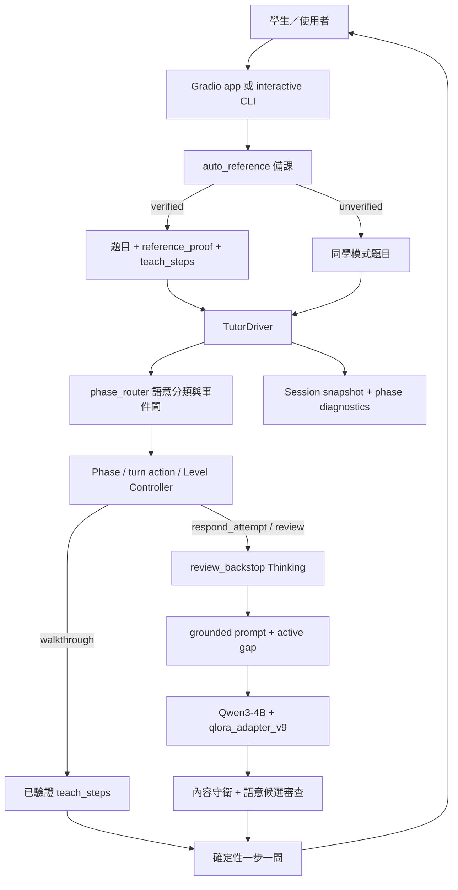
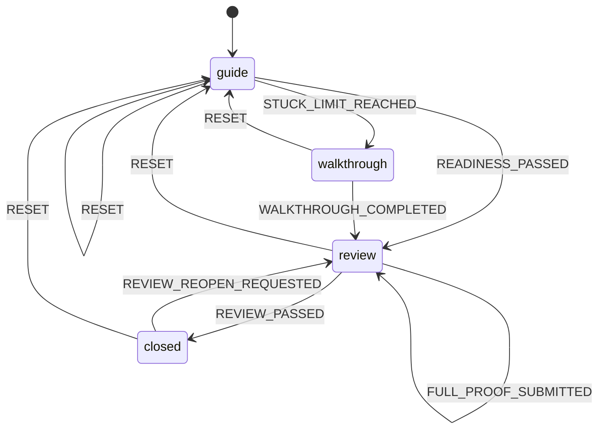

# 蘇格拉底式高等數學證明助教：整體系統架構規格

> - 狀態：現行架構基準（As-Built Specification）
> - 日期：2026-08-31
> - 適用版本：`qlora_adapter_v9`、`dataset/tutor_driver.py` 現行工作樹
> - 受眾：開發維護者、專題教授與技術評審
> - 規範用語：本文的「必須／不得／應」分別對應 MUST／MUST NOT／SHOULD

## 1. 文件地位與適用範圍

本文件是專案整體架構的單一高階規格，描述目前實際部署形態、元件責任、資料流、狀態機、失效策略、品質守門與研究依據。若歷史提案、實驗報告或 README 與本文件矛盾，判讀順序為：

1. 可執行程式與自動測試；
2. 本文件；
3. 2026-08-31 Level／Phase code review；
4. README、Notion 匯入稿與歷史設計文件；
5. 歷史評估輸出。

本文件是 **as-built spec**，不是宣稱所有設計都已完美實作。已知但尚未修正的差距會明列於「已知缺口」，不得把它們解讀成現行保證。

## 2. 專案定位

### 2.1 目標

系統要在高等數學證明題上提供 grounded、可逐輪延續、抗答案洩漏的蘇格拉底式引導。它必須：

- 讓學生保有證明的認知所有權，不直接代寫完整答案；
- 依學生連續卡住程度確定性調整提示深度；
- 用可靠參考解約束數學方向；
- 將「數學判斷」「離散流程控制」「教學語氣生成」分給不同元件；
- 在參考解或 Thinking 後盾不可用時誠實降級，不虛構驗證結果；
- 支援繁體中文與英文，語言跟隨學生而非題目；
- 讓所有重要 phase 轉移、審閱結果與防護觸發可被測試和稽核。

### 2.2 非目標

本專案目前不以以下能力為目標：

- 通用聊天機器人或不限領域的問答助手；
- 自動公布完整標準證明；
- 只靠生成模型自行決定何時升級提示或切換教學階段；
- 在沒有可靠參考解時假裝具有助教權威；
- 多租戶、高併發、公開網路 SaaS；
- 形式化證明器等級的機器可驗證正確性；
- 將 Thinking 模型的思考鏈直接展示給學生。

### 2.3 成功標準

成功不是單一模型分數，而是下列條件同時成立：

- Phase／Level／turn action 遵守本文狀態契約；
- 確定性測試與回歸基準無退步；
- 回覆不大量搬運參考解、不代寫完整證明；
- 學生卡住時提示確實逐級加深，第三次連續卡住能進入 walkthrough；
- 全文證明只有經 review verdict 通過才能進入 `closed`；
- 後盾失效時不產生假陽性的「正確／通過」結論；
- 中英文行為契約一致。

## 3. 核心架構原則

系統採混合式三權分工：

| 權責 | 主要元件 | 負責內容 | 不得負責 |
| --- | --- | --- | --- |
| 離散決策 | `phase_router.py`、`TutorDriver` | phase、事件合法性、stuck counter、turn action、守衛 | 自由生成數學內容 |
| 數學判斷 | `review_backstop.py` 的 Thinking 模型 | 找缺漏、全文審閱、局部訂正判定、walkthrough 作答判定 | 直接對學生說話、直接切 phase |
| 教學表達 | Qwen3-4B + `qlora_adapter_v9` | 將既定缺口與深度包裝為蘇格拉底式回覆 | 自行宣布通過、任意改變教學階段 |

核心原則是：**程式決定何時做什麼，Thinking 判斷數學是否成立，微調模型決定如何說。**

## 4. 系統脈絡與端到端資料流



### 4.1 新題目的備課路徑

1. 使用者提交題目敘述，可選擇附上自己的證明嘗試。
2. `auto_reference.py` 以 Thinking 模型產生最多 `PROVER_K=3` 份候選參考解。
3. VERIFIER 逐份審查；需要時由 REPAIR 修補後再驗證。
4. 通過的參考解交給 SEGMENTER 切成 3–6 個可評分教學步驟。
5. 教學步驟再經結構、語言與數學語意驗證；可建立中英文對應版本。
6. 通過時輸出 `grounding=auto_verified`、`reference_proof` 與 `teach_steps`。
7. 沒有任何可靠候選時輸出 `grounding=unverified`，runtime 必須轉入同學模式。

### 4.2 已知題目的載入路徑

`load_problems()` 從 `problems.json`、`held_out.json`、`hard_math_major.json` 載入題目，再掛載 `hint_ladders.json` 與 `hint_ladders_en.json`。正式教材與評估題可共用 Driver，但評估資料不得被誤當訓練資料。

### 4.3 每一學生回合的 runtime 順序

`TutorDriver.step()` 的邏輯順序必須維持：

1. 必要時依學生訊息更新 session 語言；walkthrough 期間語言鎖定。
2. 由統一 router 產生一次 `StudentStateDecision`。
3. review／closed 工作流優先消費該決策。
4. 一般流程依決策設定當輪 action。
5. 在單一位置更新 `stuck_count`。
6. 達門檻時由 Controller 觸發合法 phase event。
7. `respond_attempt` 視設定先做 verify-then-generate 診斷。
8. 依 phase／action／level 產生確定性回覆或模型候選。
9. 對模型候選套用內容守衛與語意審查。
10. 保存訊息、TurnLog、phase history 與事件紀錄。

任何模型文字都不得反向改寫 phase 或假造事件。

## 5. 元件責任

### 5.1 `dataset/auto_reference.py`

負責新題目備課，而不是學生對話。它的輸出契約為：

```text
verified:
  status, reference_proof, teach_steps, teach_steps_lang,
  teach_steps_source, teach_steps_initial_status,
  teach_steps_zh/en（可選）, log

unverified:
  status="unverified", log
```

參考解通過不代表教學步驟自動通過；兩者必須分別驗證。若切分或翻譯無法可靠完成，系統不得製造看似完整但問題／答案鍵錯位的步驟。

### 5.2 `dataset/phase_router.py`

負責：

- 正規化舊 session 快照；
- 將學生訊息分類為 intent、learning state、requested writer 與 turn action；
- 更新卡住計數所需的純邏輯；
- 以 `apply_phase_event()` 作為唯一持久 phase 寫入入口；
- 記錄事件是否被接受、拒絕原因與前後快照。

Thinking 分類器只可描述當輪語意事實。低信心、解析失敗或服務不可用時，router 必須採安全的確定性結果，不得讓 phase 漂移。

### 5.3 `dataset/tutor_driver.py`

這是 runtime orchestration 核心，負責：

- 維護 session state 與對話歷史；
- 組合 grounded system、phase、action、Level 與 active gap；
- 協調前置驗證、生成、重生成與內容守衛；
- 執行 walkthrough、全文 review、局部訂正佇列與 closed 收尾；
- 提供 `start()`、`step()`、`dump_state()`、`load_state()` 對外 API；
- 將題目資料、提示梯與語言資源接到同一控制流程。

### 5.4 `dataset/review_backstop.py`

統一封裝幕後 Thinking 判斷：

- `find_gaps()`：局部證明嘗試的缺漏；
- `review_full_proof()`：兩輪全文審閱；
- `judge_local_revision()`：局部訂正是否修到根本問題；
- `merge_proof_revision()`：把已核可訂正合併至工作草稿；
- `judge_walkthrough_answer()`：判斷確認問題的回答。

輸出必須解析為結構化 verdict；原始思考鏈不得進入學生訊息。`None` 代表 unavailable，不得等同空缺漏清單。

### 5.5 介面與入口

- `dataset/app.py`：Gradio 本機單人 Demo；背景備課、進度串流、單 GPU 序列化。
- `dataset/interactive_turn.py`：逐輪 CLI；以 JSON session 檔跨行程保存狀態。
- `learn_path/socratic_tutor/train_qlora.py`：QLoRA 訓練入口。
- `dataset/regression_suite.py`：推送前多層品質守門。

## 6. Phase、turn action 與 Level 契約

三者正交且優先序固定：

```text
persistent phase > turn action > hint level
```

- **phase** 表示跨回合教學工作流。
- **turn action** 表示本回合要完成的語用任務，不建立新 phase。
- **level** 只控制 `guide + normal_guide` 的提示深度；review、closed、walkthrough 不應套用一般 Level prompt。

### 6.1 持久 Phase

| Phase | 意義 | 主要退出條件 |
| --- | --- | --- |
| `guide` | 蘇格拉底式探索、回應嘗試、澄清、拒絕代寫 | 卡住門檻或 readiness 通過 |
| `walkthrough` | 已驗證步驟的一步一問教學 | 所有步驟完成 |
| `review` | 等待全文、全文檢查、逐項訂正、乾淨重交 | review 通過 |
| `closed` | 證明已確認完成，只做範圍內簡短回覆 | 使用者要求重審且有最近全文 |

### 6.2 合法事件矩陣



| 來源 | Event | 目的／review status | 必要條件 |
| --- | --- | --- | --- |
| `guide` | `STUCK_LIMIT_REACHED` | `walkthrough` | `stuck_count >= 3` |
| `guide` | `READINESS_PASSED` | `review/awaiting_submission` | Controller readiness judge 通過 |
| `walkthrough` | `WALKTHROUGH_COMPLETED` | `review/awaiting_submission` | 所有 teach steps 完成 |
| `review` | `FULL_PROOF_SUBMITTED` | `checking` 或 `rechecking` | 收到可辨識的完整證明 |
| `review` | `REVIEW_PASSED` | `closed` | 全文 review verdict 無缺漏 |
| `closed` | `REVIEW_REOPEN_REQUESTED` | `review/rechecking` | 有最近完整證明 |
| 任意 | `RESET` | `guide` | 明確重設 |

非法事件必須被記錄並拒絕，不得靜默改 phase。

### 6.3 Turn actions

現行 action 集合為：

- `normal_guide`
- `respond_attempt`
- `answer_clarification`
- `refuse_tutor_write`
- `peer_reflect`
- `post_completion_reply`
- `review_local_revision`
- `walkthrough_answer`

Action 只約束當輪輸出。例如要求 Tutor 代寫應映射為 `refuse_tutor_write`，但仍留在原 phase；學生提出局部證明步驟應是 `respond_attempt`，不能因此直接進 review。

### 6.4 Level 與卡住計數

| 時點 | `stuck_count` | 行為 |
| --- | ---: | --- |
| opener | 0 | 固定 Level 0；即使 opener 說卡住也不累計 |
| 第一次無法回答 Tutor 實際問題 | 1 | Level 1 |
| 第二次連續無法回答 | 2 | Level 2 |
| 第三次連續無法回答 | 3 | 觸發 walkthrough |
| 出現可參與的新數學進展 | 0 | 回到 Level 0 |

不確定、重貼舊內容或離題不得被誤當新進展而清空計數；錯誤但可審閱的實質嘗試可中斷「完全卡住」序列。

Level 內容契約：

- **Level 0**：只問一個宏觀聚焦問題；不得點名定理或技巧。
- **Level 1**：把同一 active gap 縮成一個具體子問題；不得完成該微步驟。
- **Level 2**：只給同一 active gap 的一個可執行微支架；可包含必要公式、構造、技巧或定理，但不得代寫其後推導或最終結論。

Level 1 與 Level 2 必須比上一問更具體，且不得切換到新的證明缺口。

## 7. 教學工作流

### 7.1 一般 Guide

Guide 回覆以 `active_gap` 和 `last_guide_question` 維持連續性。`respond_attempt` 可先由 verify-then-generate 對照參考解找第一個錯誤，再讓 v9 生成引導語。局部 verifier 的 `clear` 只表示當前步驟未發現問題，不等同完整證明已完成。

Readiness 必須由 Controller 對累積學生內容判定；生成模型即使說「可以交稿」也不能觸發 `READINESS_PASSED`。未通過 readiness 的交稿邀請會被守衛攔截。

### 7.2 Walkthrough

Walkthrough 必須遵守：

- 只使用已驗證且語言一致的 `teach_steps`；
- 進入時鎖定 `walk_lang`；
- 每輪由確定性模板輸出一個步驟與一個確認問題；
- 評分的是上一輪實際呈現的 step snapshot，不是重新索引後的可變步驟表；
- 每個問題只有一次作答機會；錯誤或部分正確時說明後揭示該步答案並前進；
- Thinking judge unavailable 時停在原步驟，不宣告對錯、不虛構進度；
- 所有步驟完成後切到 `review/awaiting_submission`，仍由學生寫完整證明；
- 學生要求代寫時不得消耗步驟。

若沒有可靠 teach steps，Driver 應 RESET 回 guide 並明確說明無法啟用逐步教學。

### 7.3 全文 Review

Review 是獨立工作流，不是一般聊天 prompt 的別名：

1. `awaiting_submission`：Controller 確定性要求學生提交全文。
2. `checking`：Thinking 進行兩輪全文審閱並輸出所有根本問題。
3. `correcting`：Driver 每輪只呈現一項問題；學生只提交局部訂正。
4. 局部訂正通過後，Thinking 把它合併至 `current_proof_draft`，才可前進下一項。
5. 問題清空後重審合併草稿；必要時進 `awaiting_clean` 要求乾淨全文。
6. 乾淨全文再次通過審閱後才觸發 `REVIEW_PASSED`。
7. 通過回覆使用確定性模板，避免模型又發明問題或主動延伸。

全文 judge unavailable 時狀態應為 `review/unavailable`，不得進入 `closed`。

### 7.4 Closed 與重審

`closed` 只允許簡短回答已完成證明範圍內的反思，不主動提出新問題、替代證法或延伸命題。學生明確質疑漏審時，可對最近完整證明觸發 `REVIEW_REOPEN_REQUESTED`；沒有可重審全文時必須維持 closed。

### 7.5 同學模式

當 `grounding=unverified` 或缺少 `reference_proof`：

- persona 必須由權威助教降為共同探索的同儕；
- 首輪必須誠實聲明沒有可靠解可核對；
- 對自己的猜測使用不確定措辭；
- 被質疑時使用 `peer_reflect` 認真重新檢查；
- 不得對整份證明給出權威式「完全正確」背書；
- 不啟用依賴參考解的 walkthrough、全文 review 或 reference leak 判斷。

## 8. Grounding、生成與內容防護

### 8.1 Grounded prompt

`reference_proof` 只存在於 system prompt 與幕後判斷，不可直接展示。Prompt 組合順序應為：

```text
BASE_SYSTEM + REFERENCE_PROOF
  + phase 或 turn-action instruction
  + backstop diagnosis（適用時）
  + Level instruction（只限一般 guide）
  + active-gap continuity block
```

### 8.2 Verify-Then-Generate

預設 `VERIFY_THEN_GENERATE=1`。只有同時符合下列條件才做生成前驗證：

- `REVIEW_BACKSTOP=1`；
- 非 peer mode；
- `phase == guide`；
- `turn_action == respond_attempt`。

診斷狀態至少區分 `issues`、`clear`、`unavailable`、`disabled` 與 `not_applicable`。它不能取代生成後候選審查，也不能自行切換 phase。

### 8.3 生成後守衛

模型候選送出前依情境執行：

- 單一問句約束；
- reference 15-gram 洩漏偵測；
- on-track 奉送操作偵測；
- Level 2 單一微支架深度審查；
- 最新學生步驟承接與所有權歸因審查；
- 數學錯誤、跳過 active gap、過早完成中間步驟的語意審查；
- 過早要求交稿攔截；
- 有已知缺漏時的錯誤背書／過度稱讚攔截；
- 回覆重複與換句話重問偵測；
- 必要問句保底；
- peer mode 權威背書攔截。

重生成次數必須有每回合上限。重生成後仍不合格時，應使用不包含解題內容的確定性安全回覆，而不是無限重試。

## 9. 失效與降級策略

| 失效點 | 現行策略 | 安全要求 |
| --- | --- | --- |
| 新題目 reference 無法驗證 | 進同學模式 | 誠實聲明，不假裝助教權威 |
| teach steps 無法可靠建立 | 不啟用 walkthrough，回 guide | 不使用機械錯位步驟 |
| guide 前置 verifier unavailable | 記錄 unavailable；候選仍須通過生成後審查 | 不注入虛構缺漏或通過結果 |
| guide 候選語意審查 unavailable | fail-closed 至安全問題 | 不放行未驗證數學內容 |
| walkthrough judge unavailable | 停在原步驟 | 不揭答、不前進、不宣告學生錯 |
| full review unavailable | 維持 `review/unavailable` | 不進 closed |
| 模型候選反覆違規 | 確定性 fallback | 不無限重生成 |
| 舊 session schema | `normalize_persisted_state()` 一次性映射 | phase 最終只能為四種合法值 |

因此，「Ollama 離線時自動降級」不是一律繼續教學；依風險不同，可能安全 fallback，也可能保守停留。

## 10. Session 狀態與可觀測性

### 10.1 最小狀態契約

Session 至少包含：

- `phase`、`review_status`、`turn_action`、`mode`；
- `stuck_count`、`active_gap`、`last_guide_question`；
- `walk_idx`、`walk_lang`、上一輪實際呈現步驟；
- `review_issues`、`review_issue_idx`、`current_proof_draft`、`review_last_full_proof`；
- `pre_generation_verification`；
- `lang`、fallback／ladder index；
- `phase_history`、`phase_events`；
- 訊息歷史與上一輪 guards。

`walk_active`、`done_closed`、`review_active`、`awaiting_clean_proof`、`writeup_asked` 是舊版相容鏡射，不得再作為主要路由真相。

### 10.2 序列化

`dump_state()` 必須保存整包 JSON-safe state、messages 與上一輪 guards；`load_state()` 必須先合併快照，再正規化舊 schema。新增狀態欄位應自然隨整包 state 保存，避免 CLI 每輪重建 Driver 時遺失 walkthrough、closed 或 fallback 進度。

### 10.3 診斷紀錄

每個學生回合應能追溯：

- 原始學生訊息；
- router intent、learning state、evidence、source 與 confidence；
- router phase、實際 phase 前後值；
- turn action 與 stuck count；
- phase event、來源、是否接受及拒絕原因；
- verifier／review status；
- 觸發過的 guards。

不保存或顯示模型原始思考鏈。

## 11. 語言契約

- 支援繁體中文與英文 system、Level、phase、action、fallback、hint ladder 與 teach steps。
- 有 opener 時以 opener 判定初始語言；否則以題目語言判定。
- 對話中，足夠長且語言明確的學生訊息可切換 session 語言。
- LaTeX 與裸算式在語言判定前視為中性內容。
- walkthrough 期間鎖定 `walk_lang`，避免答案鍵與教學步驟在中途換語言。
- 缺少目標語言步驟時應翻譯同一套已驗證步驟，不得重新切分成另一套數學順序。
- 幕後 reviewer 缺口若與 session 語言不同，學生可見 fallback 不得直接洩漏異語言內部診斷。

## 12. 資料、訓練與部署

### 12.1 資料層

- `dataset/src/`：繁體中文手寫題目與對話來源。
- `dataset/src_en/`：英文平行資料。
- `dataset/build.py`：建置 `problems.json`、`train.jsonl`、`val.jsonl`。
- `dataset/validate.py`、`dataset/test_dataset.py`：格式、角色、grounding 與資料品質檢查。
- 截至本規格日期，`problems.json` 有 50 題，工作樹建置產物為 train 747／val 83 筆。

工作樹資料已包含後續實驗素材；部署中的 v9 adapter 是既有守門通過產物。**不得假設用目前資料重新訓練就能逐位元重現 v9。**

### 12.2 訓練層

部署基底為 `Qwen3-4B-Instruct-2507`，adapter 為 `qlora_adapter_v9`。訓練採：

- 4-bit NF4 QLoRA；
- assistant-only loss masking；
- 超長對話保留最新、且含 assistant 的左截斷窗口；
- 中英文平行資料；
- v9 核准訓練使用 `MAX_LEN=1024`，其餘部署超參見專案命令與版本紀錄。

訓練腳本內建預設值不等同核准部署配方；重訓必須顯式設定版本化超參與新的輸出目錄，禁止覆寫 v9。

### 12.3 Runtime 與服務

- 本機生成：Qwen3-4B 以 4-bit 載入，適配 6 GiB RTX 4050。
- 幕後 Thinking：預設經 Ollama `qwen3-4b-thinking-2507`。
- UI：Gradio，單使用者、`default_concurrency_limit=1`。
- CLI：`interactive_turn.py`，session JSON 持久化。
- 可選遠端生成：Driver 支援 SSH exec 或 remote generation URL；服務必須綁 `127.0.0.1` 並透過 SSH tunnel／受控通道使用。

主要 runtime 開關：

| 變數 | 預設／核准值 | 意義 |
| --- | --- | --- |
| `FINAL_ADAPTER` | `qlora_adapter_v9` | 部署 adapter |
| `REVIEW_BACKSTOP` | `1` | 啟用 Thinking 後盾 |
| `VERIFY_THEN_GENERATE` | `1` | 對 `guide/respond_attempt` 做前置驗證 |
| `REVIEW_MODEL` | `qwen3-4b-thinking-2507:latest` | Ollama Thinking 模型 |
| `OLLAMA_URL` | `http://localhost:11434/api/chat` | Thinking endpoint |
| `PROVER_K` | `3` | 備課候選數 |
| `JUDGE_BACKEND` | `antigravity` | 回歸評審後端；與 runtime Tutor 無關 |

## 13. 測試、評估與品質守門

### 13.1 測試分層

| 層級 | 目的 | 代表入口 |
| --- | --- | --- |
| 純邏輯 | Phase、Level、守衛、session、解析器 | `test_phase_routing.py`、`test_driver_unit.py`、`test_review_workflow.py` |
| 資料 | 建置產物與格式一致性 | `validate.py`、`test_dataset.py` |
| 模型整合 | 真實 adapter 的提示、phase 與生成行為 | `test_driver_integration.py`、`test_driver_phase.py` |
| 後盾／備課 | Thinking 判斷與端到端教學 | `test_backstop.py`、`test_auto_reference.py`、`eval_svt_e2e.py` |
| 產品介面 | Gradio 純邏輯與流程 | `test_app.py` |
| 全專案回歸 | 基準比較與推送判定 | `regression_suite.py` |

### 13.2 回歸守門原則

- Tier 0 確定性測試與資料驗證是硬閘。
- GPU 生成層檢查洩漏、拒絕、單問句、提示升級與結構行為。
- LLM-as-judge 指標必須使用與 baseline 相同的後端；不同裁判的分數不可直接比較。
- 小樣本、雙重隨機的多輪對話與後盾分數只可作 advisory，須配合質性審查。
- 任何 baseline 更新都必須有人工確認與版本化計分卡；不得為了讓失敗消失而任意降低基準。
- 推送前應使用 `pre-push-check` 流程；本文件本身不代表已完成 GPU／Ollama 全量回歸。

## 14. 研究依據與主要架構決策

### 14.1 為何採「微調模型 + Driver」

歷史對決顯示，單靠 base grounded prompt 的抗洩漏與教學節奏不足；單靠 Thinking 模型又可能直接公布完整證明或輸出不穩。採用 v9 微調模型負責語氣、Driver 負責離散控制，可同時保留可控性與自然引導。

2026-07-12 的 8 題 × 3 情境評估中，v6 + Driver + review backstop 總平均為 4.37，高於無後盾的 4.27；這支持「Thinking 幕後找碴、微調模型面向學生」的分工，但不是對所有新領域正確性的形式化保證。

### 14.2 為何 Phase 與 Level 必須分離

Level 描述提示深度，Phase 描述跨回合工作流。把 review、walkthrough 或拒絕代寫塞進 Level 會讓狀態互相覆蓋，因此現行架構採 `phase > turn action > level`，並限制只有事件閘可以切持久 phase。

### 14.3 為何需要自我驗證備課

Grounding 是跨領域遷移的主要安全錨，但未知題目沒有既有參考解。PROVER／VERIFIER／REPAIR／SEGMENTER 管線讓系統先證明、再教學；無法驗證時降為同學模式，將「不知道」視為安全結果而非產品失敗。

### 14.4 為何 walkthrough 使用確定性步驟

學生第三次連續卡住時需要直接教學，但自由生成容易跳步、一次講太多或答案鍵不一致。預先驗證的 teach steps 提供可評分的一步一問契約，並在結束後仍要求學生自行重建完整證明。

### 14.5 為何部署維持 v9

v9 以 `MAX_LEN=1024` 修補長對話尾端訓練訊號，完整守門通過。v10 雖加入旅程資料且 loss 略降，卻在完成證明後出現可重現的主動延伸與數學錯誤，因此未升版。版本決策以端到端行為守門為準，不以 training loss 單獨決定。

## 15. 核心不變量與驗收條件

任何改動合併前都必須維持：

1. 持久 phase 永遠只屬於 `guide / walkthrough / review / closed`。
2. 所有 phase 變更只經 `apply_phase_event()`；非法事件不改狀態。
3. 模型候選文字不能觸發 `READINESS_PASSED` 或 `REVIEW_PASSED`。
4. Opener 不累計 stuck；其後依 L1、L2、walkthrough 升級。
5. Level 只作用於一般 guide，不覆蓋特殊 phase／action。
6. L1 不完成微步驟；L2 最多給一個可執行微支架，不代寫後續鏈。
7. 同一回合只能處理一個 active gap。
8. Walkthrough 一次只呈現一步和一個確認問題，完成後仍要求學生交全文。
9. Review 每輪只暴露一個根本問題；局部修正經判定後才合併。
10. 只有全文審閱通過才能進 `closed`。
11. `None/unavailable` 絕不等同「無缺漏／通過」。
12. 參考解與 Thinking 思考鏈不得直接展示給學生。
13. Peer mode 不作權威式完整正確背書。
14. Session dump/load 不得遺失 phase、walkthrough、review、language 或 guard 進度。
15. 中文與英文遵守相同的流程與安全規則。
16. 重生成有界；失敗時使用安全 fallback。

## 16. 已知缺口與修正優先序

下列項目是現行程式與目標契約的差距：

### P1：Level 2 提示梯在 prompt 組裝時提前消耗

`_get_ladder_hint(2)` 目前在 `_system()` 取提示時直接推進 `ladder_idx`。同一學生回合若重生成再次呼叫 `_system()`，可能跳到下一條 scaffold，違反「一回合一個 active gap／一個支架」。

**要求修正：** 將提示選擇改為 turn-local cache，只有最終回覆成功落地後才 commit index，並新增三項提示梯的重生成回歸測試。

### P2：Level 1 文字契約與 hint ladder 內容矛盾

Level 1 prompt 規定不點名定理，但部分中英文 `ladder[0]` 已直接寫出均值定理、比較判別法、Cauchy 等名稱。

**產品決策：** 本規格選擇嚴格契約——Level 1 可指出具體子目標方向，但不得直接點名定理或完成微步驟；hint ladder builder／validator 應驗證並修正現有資料。Level 2 才可明示一個定理、公式或構造。

### P2：Closed 重審的最近全文來源不一致

`apply_phase_event()` 接受 `current_proof_draft` 或 `review_last_full_proof`，但 router context 與 closed workflow 尚未完全使用相同判定，舊 session 可能有最近全文卻無法重審。

**要求修正：** 建立單一 `has_recent_proof()`／`recent_proof()` 介面，router、workflow 與 event guard 共用。

### P3：失效語意需持續保持精確

部分歷史文件將後盾不可用概括成「自動降級繼續」。現行高風險路徑實際採 fail-closed：walkthrough 停步、full review 不結案。

**要求修正：** 新文件與 UI 文案應沿用本規格的逐路徑失效矩陣，不再使用無條件「自動繼續」描述。

詳細重現與證據見 `docs/code-review-level-phase-2026-08-31.md`。

## 17. 元件與文件索引

| 類別 | 位置 | 用途 |
| --- | --- | --- |
| Runtime 核心 | `dataset/tutor_driver.py` | 對話 orchestration、狀態與守衛 |
| Phase 控制 | `dataset/phase_router.py` | 統一分類與合法事件矩陣 |
| Thinking 後盾 | `dataset/review_backstop.py` | 缺漏、審閱、局部修正與 walkthrough 判定 |
| 自動備課 | `dataset/auto_reference.py` | 參考解驗證與教學步驟建立 |
| UI | `dataset/app.py` | Gradio Demo |
| CLI | `dataset/interactive_turn.py` | 可持久化逐輪操作 |
| 資料建置 | `dataset/build.py` | 中英文資料產物 |
| 訓練 | `learn_path/socratic_tutor/train_qlora.py` | QLoRA 訓練 |
| 回歸守門 | `dataset/regression_suite.py` | 多層品質閘 |
| Level／Phase 審查 | `docs/code-review-level-phase-2026-08-31.md` | 現行差距與重現 |
| Verify-Then-Generate | `docs/superpowers/specs/2026-08-27-verify-then-generate-design.md` | 前置驗證子系統規格 |
| 自我驗證教學 | `self_verified_teaching_design.md` | 備課、同學模式與 walkthrough 設計脈絡 |
| 對外說明 | `README.md` | 安裝、操作與成果摘要 |

## 18. 變更規則

修改本架構時，變更者必須：

1. 先判斷是 phase、action、level、數學判斷還是表達層變更；
2. 不得以新增正則或 prompt 偷渡持久 phase；
3. 先新增失敗測試，再修改實作；
4. 同步更新本 spec、README 與相關操作文件；
5. 執行至少三個無 GPU 核心測試；
6. 涉及模型行為時執行 quick regression，推送前依風險執行完整守門；
7. 對新外部依賴、模型或裁判建立獨立版本與基準，不覆寫既有證據；
8. 在評估報告中同時揭露品質、延遲、不可用比例與未執行項目。

本規格的目的不是凍結架構，而是確保每次演進都能明確回答：哪個元件取得了新權限、哪條不變量受到影響，以及用什麼測試證明沒有破壞學生的認知所有權與數學安全。
