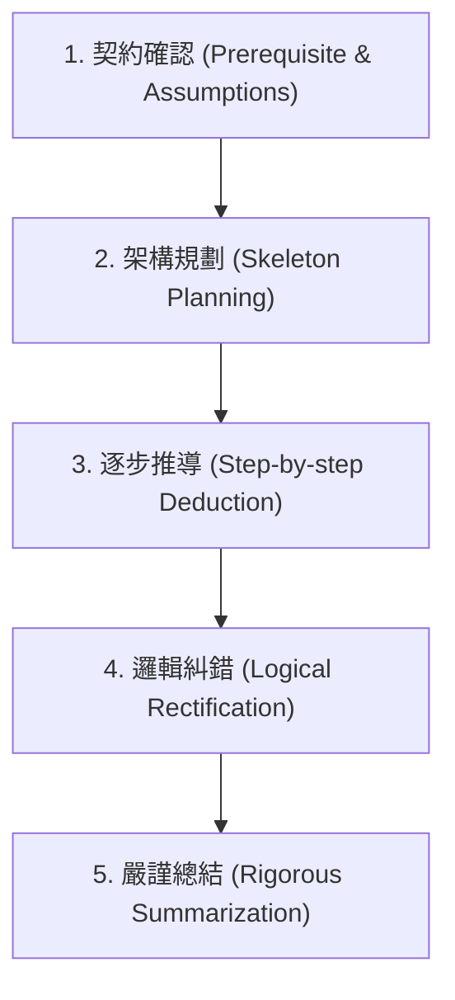

# SocraticMath 研究與微積分證明引導數據集設計規劃

> **文件定位**（2026-07-02 立項研究，非過時文件）：本文提出的 grounded 參考解錨定、
> 三種學生人格、一問一等與回合字數限制，即為現行 `dataset/` 的設計依據，沿用至今。
> 現行部署形態與後續演進見 `CLAUDE.md`；被淘汰的方法在 git tag `experiments-v2-v6`。
>
> **⚠️ 與最終實作的三處差異**（2026-08-07 對照原始碼補記，讀本文時請一併看）：
> 1. **§3.2 的「合成擴增」沒有採用。** 本文原本規劃用前沿模型批量生成對話，實際做法是
>    **全部人工撰寫並對照參考解驗證**（見 `build.py` 開頭與 memory
>    `dataset-content-authored-by-claude`）——避免把模型自己的錯誤餵回訓練資料。
>    這裡真正沿用下來的是**三種人格的設定**：`persona: confused / bright / error`
>    在 `src/dialogues_*.py` 裡逐字沿用，只是當成「人工撰寫時的分類」而不是生成 prompt。
> 2. **§3.1 的五階段命名沒有進入程式碼。** 現行 `TutorDriver` 的階段集合是
>    `review / rectify / refuse_leak / writeup_request / closed / walkthrough`，
>    概念上是本文五階段的後代（邏輯糾錯→`rectify`、嚴謹總結→`closed`），
>    但邊界與觸發條件都是後來由實測重新定義的，不要拿本文的表格對照程式。
> 3. **回合長度**：本文引述 SocraticMath 的 86 字，現行 `validate.py` 的硬性門檻是
>    **中文 ≤100 字／英文 ≤80 詞，且每則至多一個問號**。
>
> 反過來說，**§3.3 的 grounded SFT 格式是逐字沿用到今天的**——`BASE_SYSTEM` 至今仍以
> `<REFERENCE_PROOF>` 包住該題參考解，且實證為跨域抗幻覺的關鍵（移除即出現數學錯誤）。

本文件整理了對華東師範大學 ICALK 實驗室發表的 **SocraticMath** 數據集之研究成果，並針對「微積分證明引導助手」提出了一套客製化的數據集設計與生成方案。

---

## 一、 SocraticMath 數據集分析

**SocraticMath**（發表於 CIKM '24）是第一個專門為「蘇格拉底式數學引導教學」設計的人工標註多輪對話數據集。

### 1. 核心優點與設計亮點

*   **結構化的引導策略（4-Phase Strategy）**：
    SocraticMath 規定對話必須遵循一套嚴格的教學管線，使模型能夠學習到清晰的邏輯層次，而非無章法的隨機提問：
    1.  **Review（複習）**：確認學生是否掌握解題所需的先備概念或定義（例如：「你知道什麼是互質數嗎？」）。
    2.  **Heuristic（啟發）**：拋出引導性問題，促使學生主動拆解步驟（例如：「你能試著把 90 進行質因數分解嗎？」）。
    3.  **Rectification（糾錯）**：在學生算錯或卡住時，引導其自行發現錯誤並修正。
    4.  **Summarization（總結）**：在學生得出最終答案後，進行觀念鞏固與技術總結。

*   **知識增強輸入（Knowledge-Enhanced Input）**：
    在微調時，輸入給模型的資料除了「題目」和「對話歷史」外，還包含了**標準解題步驟（Solution Resolution）**與**關鍵知識標籤**。
    > [!TIP]
    > 這能確保模型在引導時有「標準答案」作為錨定物（Grounded），有效避免大語言模型（LLM）在引導過程中產生幻覺或將學生帶偏。

*   **精確的互動粒度**：
    對話的每一輪（Turn）字數控制在約 86 字以內，每次只問一個具體、聚焦的問題，避免一次給出過多提示，完美契合「一問一等」的教學原則。

---

## 二、 微積分證明問題的獨特挑戰

小學或初等數學（SocraticMath 涵蓋的範疇）多為**數值計算與代數運算**，其解題路徑是線性且結果明確的。然而，**微積分證明題**具有以下特點：
1.  **邏輯抽象性高**：證明涉及 $\varepsilon$-$\delta$ 極限定義、實數完備性、中值定理（MVT）等抽象概念，學生往往卡在「不知道怎麼起手」或「邏輯不嚴密」。
2.  **證明路徑多樣**：同一道題目可以用不同的證法（例如用 Rolle 定理、反證法或構造輔助函數）。
3.  **邏輯漏洞隱蔽**：學生常犯的錯誤不是計算錯誤，而是邏輯漏洞（例如：循環論證、變數未定義先使用、忽略區間連續性假設）。

因此，我們不能直接套用小學數學的引導模式，必須針對「證明邏輯」重新設計。

---

## 三、 微積分證明引導數據集設計方案

為了將模型微調成專業的微積分證明助教，建議採取以下數據集設計：

### 1. 蘇格拉底微積分證明引聯五階段 (Calculus Socratic Proof Strategy)

我們將 SocraticMath 的四階段擴充並調整為適合大學數學分析/微積分證明的**五階段策略**：



| 階段 | 教學目的 | 助教範例問題 |
| :--- | :--- | :--- |
| **1. 契約確認** | 確認題目給定假設與所求 Goal，釐清核心定義。 | "我們需要證明 $f$ 在 $[a,b]$ 上一致連續。你能先回顧一致連續的 $\varepsilon$-$\delta$ 定義嗎？" |
| **2. 架構規劃** | 協助學生建立證明的骨架（例如：反證法、構造輔助函數、分割區間）。 | "要證明 $f'$ 在 $(0,1)$ 上有至少兩個相異零點，我們通常會考慮 Rolle 定理。在套用前，我們需要找到函數值相等的點，這該如何利用週期性？" |
| **3. 逐步推導** | 引導學生進行代數放大縮小、不等式估計或定理套用。 | "現在我們有了 $|x^2 - 4| = |x-2||x+2|$。若我們先假設 $x$ 與 $2$ 的距離小於 $1$，我們該如何給 $|x+2|$ 一個常數上界？" |
| **4. 邏輯糾錯** | 針對證明中的硬傷（如循環引用、未定義變數）進行質疑，促使學生自行除錯。 | "你寫了『令 $\delta = \varepsilon / |x+2|$』，但 $\delta$ 的選擇可以依賴於變數 $x$ 嗎？這違反了一致連續的定義，我們該怎麼修正？" |
| **5. 嚴謹總結** | 梳理整個證明的邏輯鏈，強調證明的完整性與嚴謹度。 | "非常好！我們首先確認了假設，利用 Rolle 定理在子區間找到了第一個零點，再利用極值定理與費馬定理找到了第二個。這就完成了證明。" |

---

### 2. 數據集生成管線：基於黃金種子的合成擴增 (Synthetic Socratic Pipeline)

在缺乏大量人工標註資源的情況下，我們可以使用前沿模型（如 Gemini 1.5 Pro）結合 `CALCULUS_SEEDS` 進行高品質的合成擴增：

#### 步驟 A：擴充黃金題目集 (Calculus Seeds Expansion)
編寫 30-50 題經典微積分證明題，涵蓋：
*   數列與函數極限（$\varepsilon$-$N$, $\varepsilon$-$\delta$ 證明）
*   連續性與一致連續性
*   微分中值定理（Rolle, Lagrange, Cauchy）
*   黎曼積分與微積分基本定理
*   級數收斂性

每道題需附帶**無瑕疵的標準 LaTeX 參考解答**。

#### 步驟 B：生成不同學生人格（Personas）的對話
使用 LLM 扮演「學生」，產生三種對話軌跡以豐富數據集：

```
                             ┌───> 1. 優秀學生 Persona (學習順利推導的路徑)
[黃金微積分題目 + 標準解答] ──┼───> 2. 迷茫學生 Persona (學習如何從零引導、給予 Hint)
                             └───> 3. 犯錯學生 Persona (學習如何進行邏輯糾錯/Rectification)
```

1.  **優秀學生（The Bright Student）**：
    *   **行為**：能答對概念，代數計算正確。
    *   **訓練目的**：讓模型學習「順暢的證明推進與步驟確認」。
2.  **迷茫學生（The Confused Student）**：
    *   **行為**：經常回答「我不知道該怎麼開始」或「這是什麼定理」。
    *   **訓練目的**：讓模型學會「提供局部的提示（Hints）、拆解成更小的步驟」。
3.  **犯錯學生（The Error-Prone Student）**：
    *   **行為**：故意寫出微積分經典錯誤，例如：
        *   在 $\varepsilon$-$\delta$ 證明中讓 $\delta$ 依賴於 $x$。
        *   在未確認函數可微的情況下直接套用中值定理。
        *   循環論證（利用欲證結論來證明中間步驟）。
    *   **訓練目的**：讓模型學會**邏輯糾錯（Rectification）**，準確指出邏輯漏洞並引導學生自行修正。

---

### 3. 微調格式設計 (Grounded SFT Format)

在 fine-tuning 時，強烈建議將標準解答（Grounding）放入 `system` 提示詞中，使模型在擁有答案的基礎上進行引導：

```json
{
  "messages": [
    {
      "role": "system",
      "content": "You are a Socratic calculus proof tutor. You are holding the following reference proof: <REFERENCE_PROOF>... </REFERENCE_PROOF>. Your task is to guide the student to discover this proof step-by-step using Socratic questions. Never reveal the proof directly. Output exactly ONE question at a time."
    },
    {
      "role": "user",
      "content": "Prove that the sequence a_n = 1/n converges to 0."
    },
    {
      "role": "assistant",
      "content": "To prove this using the limit definition, given any \epsilon > 0, we need to find an integer N. Can you state the inequality that a_n must satisfy for n >= N?"
    },
    ...
  ]
}
```

這與 SocraticMath 在輸入端加入標準解答的作法一致，能最大化保證微分析證明的正確性與邏輯嚴密性。
